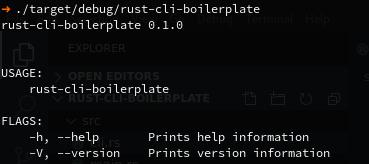

# Rust cli boilerplate.

Contains [clap](https://clap.rs/) for arguments parsing and nothing else.

# Screenshot


# How to use this boilerplate?

- Replace name, authors etc in [Cargo.toml](./Cargo.toml) and you are good to go.

- Using cargo [generate](https://github.com/ashleygwilliams/cargo-generate).
```sh
cargo generate --git https://github.com/pjmp/rust-cli-boilerplate.git
```
